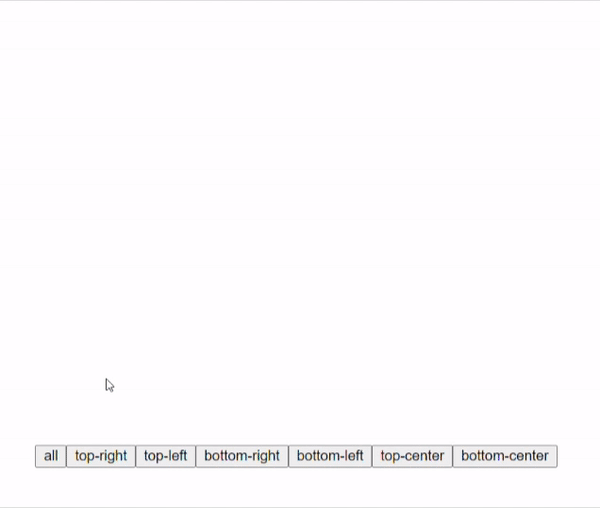

# Mosha Vue Toastify

[](https://travis-ci.com/szboynono/mosha-vue-toastify)

轻量好看好用的Vue3通知提醒组件

[English](./README.md) | 简体中文



## 别说太多，用了再说

来文档中的[体验区](https://szboynono.github.io/mosha-vue-toastify/)试一试吧！

## 功能
- 简单易用，看看[这里](#精华)
- 划屏取消提醒
- 完全支持Composition API
- 完全支持typescript
- 超级轻量
- 自定义提醒
- 用好玩的进度条提醒剩余时间
- 敬请期待更多新功能！

## 安装

NPM:

```bash
$ npm install mosha-vue-toastify
```

Yarn:

```bash
$ yarn add mosha-vue-toastify
```

## 精华
```html
<template>
  <button @click="toast">Toast it!</button>
</template>
```
```ts
<script lang='ts'>
import { defineComponent } from 'vue'
import { createToast } from 'mosha-vue-toastify';
import 'mosha-vue-toastify/dist/style.css'

export default defineComponent({
  name: 'HelloWorld',
  setup () {
    const toast = () => {
        createToast('就这么简单噢')
    }
    return { toast }
  }
})
</script>
```

## 自定义


`createToast` 方法接受两个参数, 第一个可以是一个字符串也可以是一个像这样的对象 `{ title: 'some title', description: 'some good description'}`, 第二个参数是options，可以自定义提醒框。


Options:

| name        | type           | default  | description |
| ------------- |:-------------:| -----:| -----:|
| type      | 'info', 'danger', 'warning', 'success', 'default' | 'default' | 给与不同的样式 |
| timeout      | number      |   5000 | 自定义多少ms后关闭
| position      | 'top-left', 'top-right', 'bottom-left', 'bottom-right', 'top-center', 'bottom-center' |   'top-right' | 自定义提醒框位置 |
| showCloseButton | boolean      |    true | 显示关闭按钮 |
| showIcon | boolean      |    false | 显示图标 |
| transition | 'bounce', 'zoom', 'slide' | 'bounce' | 自定义动画 |
| hideProgressBar | boolean      |    false | 关闭进度条 |
| swipeClose | boolean      |    true | 是否允许滑动关闭 |
| toastBackgroundColor | string      | default color | 自定义背景颜色 |
| onClose | function      | N/A | 这个方法会在提醒框消失时调用 |

## 支持一下吧

喜欢的话给这个[项目](https://github.com/szboynono/mosha-vue-toastify) 一个⭐吧。有什么建议的话欢迎开issue噢。